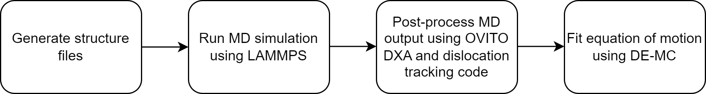

# DislocCode
A collection of python tools to setup, run, and analyse molecular dynamics (MD) simulations of edge dislocations in face-centered cubic (FCC) Ni.

The general workflow is:

### Generating the structure files:  
[**structure_gen**](./structure_gen)
- `gen_1disloc_Ni.py` generates a single $\frac{a_0}{2}\langle 110 \rangle{111}$ edge dislocation in an FCC Ni cell.
- `gen_111_atoms.py` generates a slab of FCC Ni.  

### Running the MD shear simulation:  
[**lammps_scripts**](./lammps_scripts)  
- `lmp_force_ramp.py` runs an MD simulation such that the simulation box is sheared to move the edge dislocation studied.  

### Post-procecessing the MD trajectories:  
[**dislocation_tracking**](./dislocation_tracking)  
Scripts to post-process dislocation simulation output  
- `ovito_disloc.py` detects dislocations using OVITO DXA and records their coordinates.  
- `dislocatio_script.py` tracks dislocations detected by OVITO DXA, sorting their coordinates and assigning them to the correct dislocation. This outputs position-time data for every dislocation detected.  

### Fitting an equation of motion to dislocation position data
[**de_mcmc**](./de_mcmc)
- `mc3_de_mc.py` fits the parameters of an equation of motion to MD dislocation trajectories using differential evolution Monte Carlo (DE-MC).   
- `de_mc_analysis.ipynb` a step-by-step tutorial on how to analyse the output of the fitting procedure, where some sample data is also provided. 

## Requirements 
**LAMMPS Python Module and Shared library**:

https://docs.lammps.org/Python_install.html

**Ovito python libraries**:

https://www.ovito.org/docs/current/python/introduction/installation.html

**MC3**:

https://mc3.readthedocs.io/en/latest/get_started.html

**ASE**:

https://wiki.fysik.dtu.dk/ase/install.html

Python libraries:
- Numpy
- Matplotlib
- Scipy
- Pandas
- Seaborn
